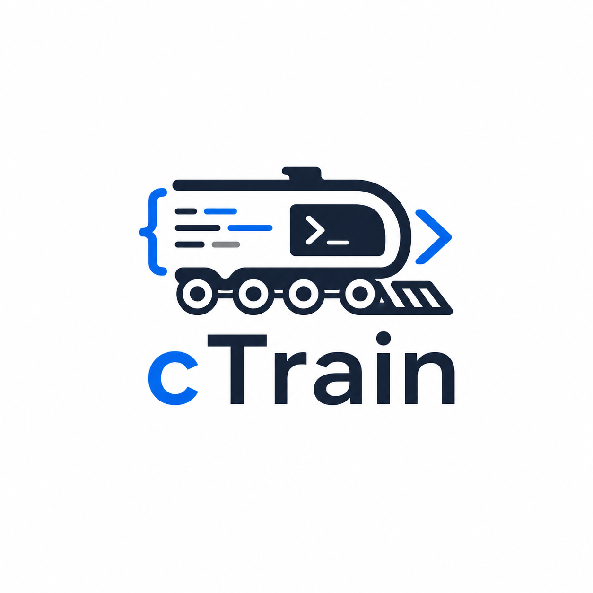

# cTrain

Practice typing real Java code inside VS Code.

> Personal project — my goal is to pass the Oracle Java SE 25 (1Z0-831) certification exam, so the lessons focus on getting there.

## Lessons

82 Java typing lessons, grouped so the next choice is easier to scan:

- **Foundations** — classes, methods, collections, generics, streams, exceptions.
- **Java 25 Cert Exam** — the focused certification block (ids `50`-`69`, growing at `80`+) for Oracle Java SE 25 (1Z0-831).
- **Java 26** — headline features such as lazy constants, with preview features clearly flagged.

Each public snippet lesson opens with a concise teaching comment and includes a short key-line note where a new concept first appears.

## How to use

1. Press `Ctrl+Shift+P` to open the Command Palette.
2. Run `cTrain: Start Lesson`.
3. Pick a lesson.
4. Type over the ghost text until the lesson is complete.
5. Run `cTrain: Mock Exam` when you want a scored, objective-weighted 50-question certification drill.

If you used `Ctrl+P`, type `>cTrain` instead of `cTrain`.

## Practice your own code

1. Open a source file.
2. Select the code you want to practice, or leave nothing selected to use the whole file.
3. Run `cTrain: Practice Current File` from the Command Palette or editor right-click menu.

## Typing tips

- Paste is blocked by default so the session measures typing, not copying. The first rejection explains the muscle-memory reason in the status bar.
- The status bar shows progress, WPM, elapsed time, and mistakes. When paused, it shows a warning-colored `[PAUSED]` prefix.
- Symbol mistakes include keyboard hints, such as `(` with `Shift+9`, in status feedback and editor hovers.
- After a lesson, choose `Next Lesson` to continue in catalogue order or `Retry` to repeat it.
- Wrong completion-check answers become recall reviews due on day 1, day 3, and day 7.
- Lesson rows show personal-best WPM with error rate and any due recall-review count.
- The lesson picker title tracks the 12-day, 900-minute Java 25 study sprint from the certification map.
- Mock exams draw from certification-focused lesson completion checks, shuffle answer choices, use the Java SE 25 50-question / 120-minute / 68% pass format, sample by objective, and save objective-level missed-question review.
- Mock summaries show the rolling last-5 average, whether the 3 consecutive 80% readiness gate is met, and any objectives below 70% in the final-week signal.

## Packaging

- Run `npm run package` to build the installable `ctrain-0.1.0.vsix`.
